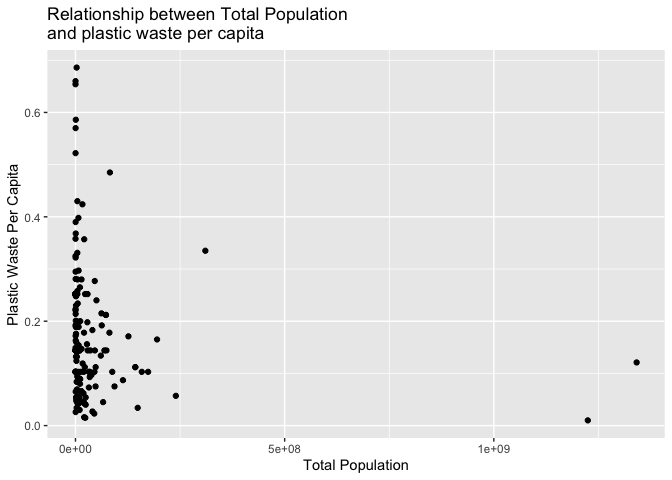

Lab 02 - Plastic waste
================
Conor Lacey
01/19/23

## Load packages and data

``` r
suppressWarnings(library(tidyverse)) 
```

``` r
plastic_waste <- read.csv("data/plastic-waste.csv")
```

## Exercises

### Exercise 1

Histogram of plastic waste per capita faceted by continent

``` r
plastic_waste %>%filter(plastic_waste_per_cap < 3.5) %>% #filtering out 3.5
ggplot(aes(x = plastic_waste_per_cap)) +
  facet_wrap(~continent)+
  labs(title = "Plastic Waste Per Capita by Continent")+
  xlab("Plastic Waste Per Capita")+
  ylab("Count")+
  geom_histogram(binwidth = 0.1,color="black")
```

<!-- -->

From the histogram it appears Africa is the least variant continent of
all the continents. It also appears that North America is the most
variant continent of all the continents.

### Exercise 2

The density distribution of plastic waste per capita faceted by
continent

``` r
plastic_waste %>%filter(plastic_waste_per_cap < 3.5) %>% 
ggplot(aes(x = plastic_waste_per_cap,
           color=continent,
           fill=continent)) +
  labs(title ="Plastic waste per capita by continent")+
  xlab("Plastic Waste Per Capita")+
  ylab("Density")+
  geom_density(alpha=0.3)
```

<!-- -->

### Exercise 3

We defined the color and fill of the curves by mapping the aesthetics
because they are based on the data values (the continent label). The
alpha level is not based on the data values,therefore it goes in the
geom as a characteristic.

### Exercise 4

In contrast to box plots, violins reveal the continuous density. It is
apparent here that the violins are just a mirrored density distribution
of each continent displayed in a similar way to box plots.

The box plots are able to display the quartiles and the median of the
data. Violins cannot do this.

``` r
plastic_waste %>%filter(plastic_waste_per_cap < 3.5) %>% 
ggplot( mapping = aes(x = continent, 
                      y = plastic_waste_per_cap)) +
    labs(title ="Plastic waste per capita by continent")+
  ylab("Plastic Waste Per Capita")+
  xlab("Continent")+
  geom_violin()
```

<!-- -->

### Exercise 5

There appears to be a positive relationship here between plastic and
mismanaged plastic waste per capita. However, it also appears this
relationship weakens with increased levels of mismanaged plastic waste
per capita.

``` r
plastic_waste %>%filter(plastic_waste_per_cap < 3.5) %>% 
ggplot( mapping = aes(x = mismanaged_plastic_waste_per_cap, 
                      y =plastic_waste_per_cap)) +
    labs(title ="Relationship between Plastic and Mismanaged Plastic Per Capita")+
  ylab("Plastic Waste Per Capita")+
  xlab("Mismanaged Plastic Waste Per Captia")+
  geom_point()
```

<!-- -->

### Exercise 6

Coloring the points by continent it appears there is a positive
relationship between plastic waste per capita and mismanaged plastic
waster per capita.The relationship is still weird however when looking
at Asia as the relationship weakens as the level of mismanaged plastic
waste per capita increases. There also appears to be no relationship in
Europe.

``` r
plastic_waste %>%filter(plastic_waste_per_cap < 3.5) %>% 
ggplot( mapping = aes(x = mismanaged_plastic_waste_per_cap, 
                      y =plastic_waste_per_cap,
                      color=continent)) +
    labs(title ="Relationship between Plastic and Mismanaged Plastic Per Capita")+
  ylab("Plastic Waste Per Capita")+
  xlab("Mismanaged Plastic Waste Per Captia")+
  geom_point()
```

<!-- -->

### Exercise 7

There does not appear to be a relationship for either plot.

``` r
plot<-plastic_waste %>%filter(plastic_waste_per_cap < 3.5) %>% 
ggplot( mapping = aes(x = total_pop, 
                      y = plastic_waste_per_cap)) +
    labs(title ="Relationship between Total Population
and plastic waste per capita")+
  ylab("Plastic Waste Per Capita")+
  xlab("Total Population")+
  geom_point()
suppressWarnings(print(plot))
```

<!-- -->

``` r
plastic_waste %>%filter(plastic_waste_per_cap < 3.5) %>% 
ggplot( mapping = aes(x = coastal_pop, 
                      y = plastic_waste_per_cap)) +
    labs(title ="Relationship between Coastal Population and 
Plastic Waste Per Capita")+
  ylab("Plastic Waste Per Capita")+
  xlab("Coastal Population")+
  geom_point()
```

<!-- -->

### Exercise 8

There appears to be no relationship between plastic waste per capita and
coastal population proportion

``` r
plot<-plastic_waste %>%filter(plastic_waste_per_cap < 3.5) %>% 
ggplot( mapping = aes(x = (coastal_pop/total_pop), 
                      y = plastic_waste_per_cap,
                      color = continent)) +
    labs(title ="Plastic Waste Vs. Coastal Population Proportion",
         subtitle = "By Continent")+
  ylab("Plastic Waste Per Capita")+
  xlab("Coastal Population Proportion (Coastal/total population)")+
  geom_point()+
  geom_smooth(inherit.aes = FALSE,
              aes(x = (coastal_pop/total_pop), 
                  y = plastic_waste_per_cap),
              color="black")
suppressWarnings(print(plot))
```

    ## `geom_smooth()` using method = 'loess' and formula = 'y ~ x'

<!-- -->

## Pro-Tips

### Excercise 3

Try this :D

ggplot(data = plastic_waste, mapping = aes(x = continent, y =
plastic_waste_per_cap)) + geom_violin()+ geom_boxplot(width=.3,
fill=“green”) + stat_summary(fun.y=median, geom=“point”)

### Exercise 5

Helpful
reference:<http://www.sthda.com/english/wiki/ggplot2-themes-and-background-colors-the-3-elements>
